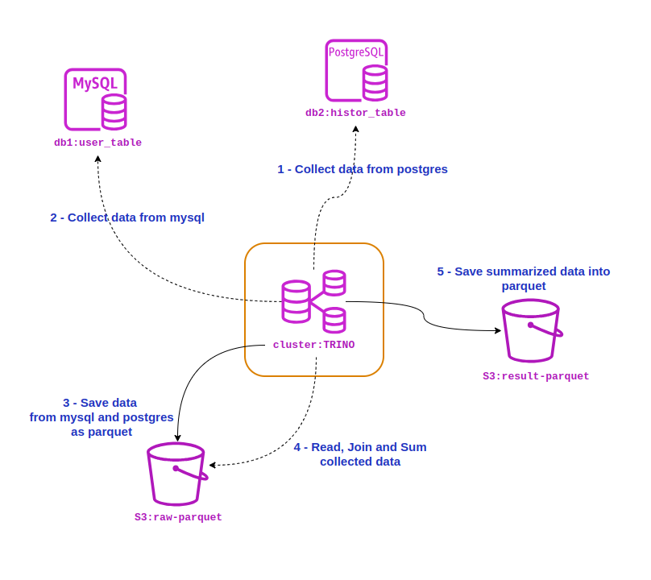

# TRINO DB WITH MYSQL, POSTGRES, S3 AND PARQUET

## ABOUT
this project demonstrates how to use trino witn one coordinator and multiple workers to process queries from two different databases, process data then save them in parquet format into S3 ( locally )

## ARCHITURE



## FOLDER ARCH

```sh
.
├── config/
│   │
│   ├── catalog/            # connector settings
│   │   ├── mysql.properties
│   │   ├── pg.properties
│   │   └── s3.properties
│   │
│   ├── coordinator/        # coordinator trino config
│   │   ├── config.properties
│   │   ├── jvm.config
│   │   ├── log.properties
│   │   └── node.properties
│   │ 
│   ├── worker/             # worker trino config
│   │   ├── config.properties
│   │   ├── jvm.config
│   │   ├── log.properties
│   │   └── node.properties
│   │
│   ├── mysql/database-script.sql   # mysql init script
│   │   
│   ├── pg/database-script.sql      # postgres init script
│   │   
│   └── s3/init-s3.py               # s3 init script
│
└── docker-compose.yml      # docker compose to start all containers

```


## DOCKER COMMANDS

```sh
# start all containers
docker compose up

# stop and remove containers 
docker compose down --remove-orphans

# stop all container, removing volumes and recreating all images
docker compose down --remove-orphans -v
docker compose build --no-cache
docker compose up --force-recreate

```

## TRINO QUERIES
```sql
-- show all catalogs                                                                                                                            
SHOW CATALOGS;

-- SELECT IN DB1 PG
show schemas from pg
show tables from pg.db1
SELECT USER_NAME, USER_CATEGORY FROM pg.db1.user_table

-- SELECT IN DB2 MYSQL
show schemas from mysql
show tables from mysql.db2                                   
SELECT USER_NAME, AMOUNT FROM mysql.db2.history_table
	

-- SELECT JOINING DB1 TO DB2
SELECT
	user_from_db1.USER_CATEGORY,
	SUM(history_from_db2.AMOUNT) AS sum_amount
FROM 
	pg.db1.user_table as user_from_db1
JOIN 
	mysql.db2.history_table as history_from_db2
ON 
	user_from_db1.USER_NAME = history_from_db2.USER_NAME
GROUP BY 
	user_from_db1.USER_CATEGORY

-- ===================================== COLLECT DB1 RAW DATA INTO PARQUET
-- CREATE SCHEMA
CREATE SCHEMA IF NOT EXISTS s3.raw
-- COLLECTING TO PARQUET
CREATE TABLE s3.raw.user_table WITH (format = 'PARQUET') AS
SELECT USER_NAME, USER_CATEGORY FROM pg.db1.user_table;
-- CHECKING PARQUET DATA COLLECTED
SELECT USER_NAME, USER_CATEGORY FROM s3.raw.user_table;

-- ===================================== COLLECT DB2 RAW DATA INTO PARQUET
-- CREATE SCHEMA
CREATE SCHEMA IF NOT EXISTS s3.raw
-- COLLECTING TO PARQUET
CREATE TABLE s3.raw.history_table WITH (format = 'PARQUET') AS
SELECT USER_NAME, AMOUNT FROM mysql.db2.history_table;
-- CHECKING PARQUET DATA COLLECTED
SELECT USER_NAME, AMOUNT  FROM s3.raw.history_table;


-- ================== PROCESSING RAW DATA PARQUET AND SAVING RESULT
-- CREATE SCHEMA
CREATE SCHEMA IF NOT EXISTS s3.result
-- SUMMARIZING AND SAVIN PARQUE RESULT
CREATE TABLE s3.result.total_by_user_category WITH (format = 'PARQUET') AS
SELECT
	user_raw.USER_CATEGORY,
	SUM(history_raw.AMOUNT) AS sum_amount
FROM 
	s3.raw.user_table as user_raw
JOIN 
	s3.raw.history_table as history_raw
ON 
	user_raw.USER_NAME = history_raw.USER_NAME
GROUP BY 
	user_raw.USER_CATEGORY;

-- ============ CHECK RESULT
select * from s3.result.total_by_user_category

--  ======= check all files parquet created inside container
-- docker exec trino_s3 aws --endpoint-url=http://localhost:4566 s3 ls s3://bucket1/ --recursive

```


